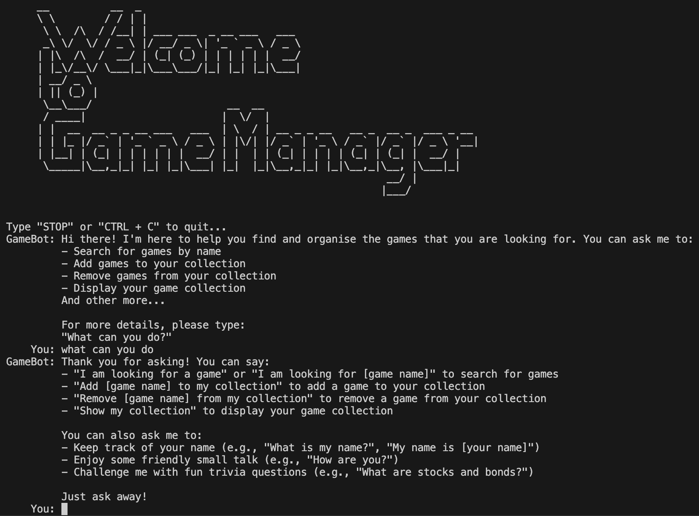
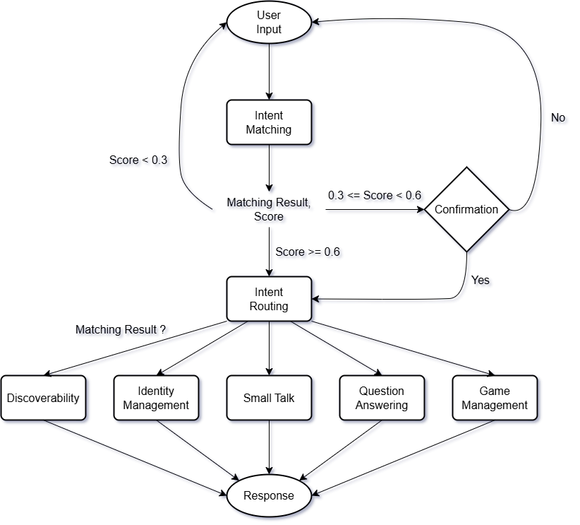

# game-manager
A chatbot system developed for a game shop, primarily designed to handle game transactions and management. The implementation uses a Steam database and currently focuses only on the management aspect, serving as a proof of concept for future expansion.

The chatbot provides an intuitive and friendly experience for users to:

- Track and manage their game collection
- Search for games by name from a large dataset
- Engage in small talk and trivia
- Enjoy a personalised interaction through name recognition
- Discover available features through built-in guidance



## Table of Contents

- [Functionality](#functionality)
  - [1. Intent Matching](#1-intent-matching)
  - [2. Identity Management](#2-identity-management)
  - [3. Transactions (Game Management)](#3-transactions-game-management)
  - [4. Information Retrieval & Question Answering](#4-information-retrieval--question-answering)
  - [5. Small Talk](#5-small-talk)
  - [6. Discoverability](#6-discoverability)
- [Architecture](#architecture)
- [TF-IDF Vectorizer](#tf-idf-vectorizer)
- [Cosine Similarity](#cosine-similarity)
- [Data Preprocessing & Query Handling](#data-preprocessing--query-handling)
- [Datasets](#datasets)
- [Installation](#installation)
  - [1. Clone Repository](#1-clone-repository)
  - [2. Create Virtual Environment](#2-create-virtual-environment-if-needed)
  - [3. Install Dependencies](#3-install-dependencies)
  - [Run Code](#run-code)

## Functionality
The chatbot consists of six major modules:

### 1. Intent Matching

Intent matching enables the system to interpret the meaning behind user input.

- Compares user queries with predefined entries in the corpus
- Routes the conversation flow to the correct module
- Powers search, control flow, and similar-game matching

### 2. Identity Management

Provides a personalised user experience by remembering and updating user names.

- Users can ask “What is my name?”
- If no name is stored, the chatbot asks for one
- Users can explicitly provide or change their name (“My name is John”)

### 3. Transactions (Game Management)

Allows users to manage their game collection:

- Add games: “Add Minecraft to my collection”
- Remove games: “Remove Minecraft from my collection”
- View collection: “Show my collection”
- Prevents duplicate additions or invalid removals
- Displays the collection in a table format when available

### 4. Information Retrieval & Question Answering

Handles trivia and FAQ-style queries.

- Matches questions to a QA dictionary
- Returns predefined answers
- Randomly selects among multiple valid answers to increase conversational variety

### 5. Small Talk

Supports casual and friendly conversation.

- Uses a dataset tailored for greetings and informal queries
- Multiple input patterns can map to the same response
- Enhances user engagement and conversation flow

### 6. Discoverability

Helps users understand what the chatbot can do.

- Provides an overview of features at program startup
- Users can ask “What can you do?” to see available commands and examples

## Architecture



The chatbot follows a structured and modular pipeline. When the user enters a query, the system begins by performing intent matching, comparing the input against a predefined corpus using similarity scores. The behaviour of the chatbot depends on the similarity threshold:

- < 0.3 → The chatbot cannot confidently determine intent and restarts the process
- 0.3 – 0.6 → A confirmation prompt is shown, asking the user whether to proceed or restart
- \> 0.6 → The chatbot confidently routes the query to the appropriate module

Once the intent is validated, the query is sent to one of the core systems:

- Discoverability
- Identity management
- Small talk
- Question answering
- Game management

Each module then generates a final response and returns control to the main loop.

The system’s implementation leverages several important components, including TF-IDF vectorisation, cosine similarity, data loading utilities, and preprocessing functions. These contribute to both the chatbot’s accuracy and flexibility.

## TF-IDF Vectorizer

The first step in processing user input is transforming text into numerical features using a term-document matrix, where:

- Rows represent terms
- Columns represent documents
- Each cell contains a weight based on TF-IDF (term frequency–inverse document frequency)

TF-IDF is chosen over simpler weighting methods because it emphasizes words that characterise each document while downplaying common terms. Although sparse matrices can be memory-inefficient, this project’s dataset is small enough that this trade-off is acceptable.

Using Scikit-learn, the TF-IDF vectoriser is trained on a fixed corpus. The corpus undergoes tokenisation and lemmatisation before transformation. Stop-word removal is intentionally disabled because many personal or conversational inputs (e.g., “How are you?”) consist mostly of stop words and would lose meaning if removed.

## Cosine Similarity

Cosine similarity is used alongside the TF-IDF vectoriser for intent matching. The user query is:

- Lemmatised
- Transformed into a TF-IDF vector
- Compared against the corpus matrix

The system identifies the highest-scoring document and extracts both the response and the associated similarity score. This same process is used in the game search feature, which retrieves closely matching game titles.


## Data Preprocessing & Query Handling

Several utility functions support data loading and query processing. Because datasets come in various formats, the system converts CSV and JSON files into Python dictionaries and merges them into a uniform corpus.

- Key dataset handling features include:
- Answer lookup for trivia and small talk
- Search and filtering functions for games
- User collection storage, maintained in a JSON file
- Functions such as:
    - `add_json`
    - `remove_json`
    - `clear_json`
    - `load_collection`

These allow users to seamlessly update and retrieve their stored game library.

## Datasets

Three main datasets support the chatbot:

1. QA Dataset

    - ~1,500 question–answer pairs
    - Multiple responses can exist under the same key
    - Reformatted into a dictionary where each key maps to a list of answers

2. Small Talk Dataset

    - ~10,000 entries of greetings and common conversational inputs
    - Provides smooth, varied, and natural small-talk responses

3. Game Dataset (Steam)

    - Sourced from Steam, with 97,000+ games

    - Original dataset had 39 features, reduced to 9 for this project:
        - AppID
        - name
        - release_date
        - price
        - score_rank
        - developers
        - publishers
        - categories
        - genres

    - Current system only uses:
        - name
        - release_date
        - genres
        - price

## Installation

### 1. Clone repository
```
git clone https://github.com/melvinkisam/game-manager.git
```
### 2. Create virtual environment (if needed)
```
python -m venv venv
```
Then activate:
```
source venv/bin/activate   # macOS/Linux
venv\Scripts\activate      # Windows
```
### 3. Install dependencies
```
pip install -r requirements.txt
```
### Run code
Make sure you are on the directory of the `main.py` and then run:
```
python main.py
```